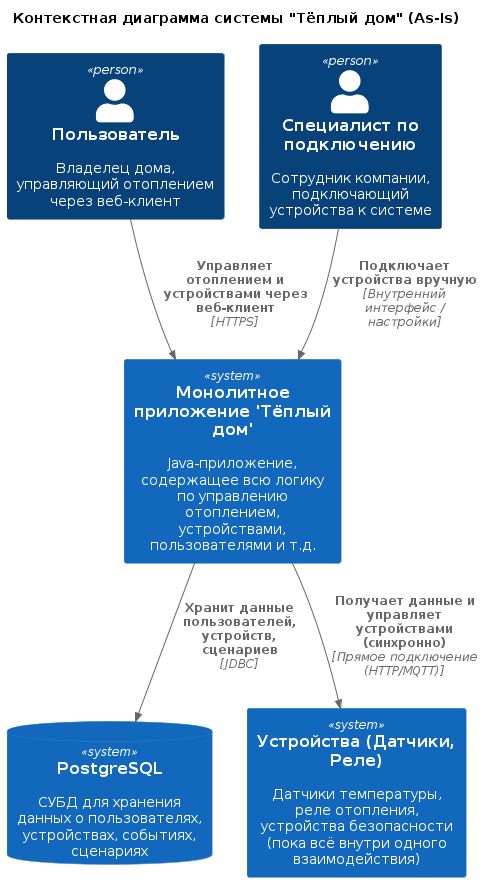

# Project_template

Тип: Материал
Родитель: Описание проекта для 11 когорты (https://www.notion.so/11-03abbbbc8bcb49ed9b85c9b6d1174056?pvs=21)

# Задание 1. Анализ и планирование

### 1. Описание функциональности монолитного приложения

**Управление отоплением:**

- Пользователи могут удалённо включать/выключать отопление в своих домах и проверять температуру
- Всё управление идёт от сервера к датчику синхронно

**Мониторинг температуры:**

- Пользователи могут просматривать текущую температуру в своих домах через веб-интерфейс    
- Данные о температуре также получаются через запрос от сервера к датчику синхронно

### 2. Анализ архитектуры монолитного приложения

- Язык программирования: Java
- База данных: PostgreSQL
- Архитектура: Монолитная, все компоненты системы (обработка запросов, бизнес-логика, работа с данными) находятся в рамках одного приложения.
- Взаимодействие: Синхронное, запросы обрабатываются последовательно.
- Масштабируемость: Ограничена, так как монолит сложно масштабировать по частям.
- Развёртывание: Требует остановки всего приложения.

### 3. Определение доменов и границы контекстов

домен: Управление отоплением
домен: Управление освещением
    контекст: Управление светом, сценарии (умный свет)
домен: Управление воротами
домен: Наблюдение(камера, видеопоток)
домен: Оркестрация устройств
    контекст: Подключение, регистрация, настройка всех устройств
домен: Пользователи и аутентификация
    контекст: Пользователи, авторизация, права, роли
домен: Уведомления
    контекст: Email, Push, SMS уведомления
домен: Биллинг
    контекст: Подписки, оплата, тарифы

### **4. Проблемы монолитного решения**

- сложно масштабировать, особенно когда на разные функциональные части системы идет разная нагрузка
- Высокий риск ошибок, что ведет к доп. затратам(изменения в одной части приложения могут непредсказуемо влиять на другие части)
- замедление релиза новых функций тк любое изменение в монолите может повлиять на всю систему и значит надо учитывать при разработке и тестировать все
- трудно управлять командой(командами)

### 5. Визуализация контекста системы — диаграмма С4

# Задание 2. Проектирование микросервисной архитектуры

**Диаграмма контейнеров (Containers)**

**Диаграмма компонентов (Components)**

**Диаграмма кода (Code)**

# Задание 3. Разработка ER-диаграммы

# ✅ Задание 4. Создание и документирование API

Cпроектирую API для микросервисов Device Orchestrator и Notification Service

### 1. Тип API

* для микросервиса Device Orchestrator использую несколько эндпоинтов с REST API взаимодействием тк сервис отвечает за 
управление устройствами (отправка команд, получение состояния) и эти задачи требуют немедленного ответа: юзер или 
другой сервис ожидает подтверждения, что команда выполнена или если юзер отправляет команду "вксючить свет", то он 
хочет сразу узнать, успешно ли она выполнена

* для микросервиса Notification Orchestrator использую несколько эндпоинтов с AsyncAPI взаимодействием тк сервис 
отвечает за отправку уведомлений, а они могут быть отправлены с задержкой

### 2. Документация API

- [Device Orchestrator API](docs/device-orchestrator-api.yaml)
- [Notification Service API](docs/notification-service-api.yaml)